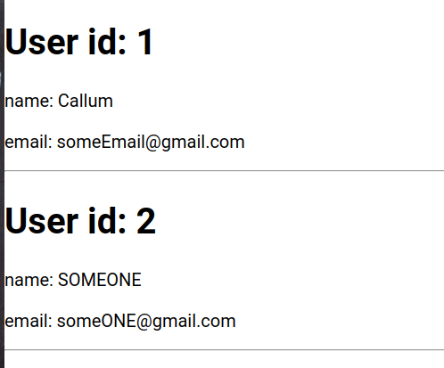

So [last post](https://penguindevs.xyz/normalizing-redux-state/) I discussed why it might be a good idea to normalize your redux state.

The problem is however, is that you can't just display your data in this format. You need to 'de-normalize' it once you want to display it. In this post I will show you how you can do that, as well as the options surrounding it.

Let's continue where we left of from the last post with this normalized state:

```jsx
state = {
  users : {
    byId: {
      1 : {
        userId: 1,
        name: "Callum",
        email: "someEmail@gmail.com"
        blogs: [12, 15] //Arr of blogs associated to this user
      },
      ...
    },
    allIds: [1], //Arr of unique IDs to indicate order.
  },
  blogs: {
    byId: {
      12: {
        id: 12,
        name: "Penguin Blog",
      },
      15: {
        id: 15,
        name: "Cat Blog",
      }
    },
    allIds: [12, 15]
  }
  isFetching: false,
  lastUpdated: 1439478405434,
}
```

Using this state, we will create a simple web page that displays a list of users.

To start, let's keep it simple and display a list of users like so:



There are two differing ways to do this:

1) We insert all users into an array one by one, according to the order of the `user.allIds` array, and then `map` through each user to display the list.

2) We iterate through the `user.allIds` array, passing the id to a `User` component via props which then connects to the redux store itself and fetches the specific user from the store.

The first option results in less connected components, so it would have better performance, right? *Wrong.*

Benchmarks have shown that the **more connected components** you have, the **more optimal** your app actually is.

Personally, I prefer the second approach because we don't need to *undo* what we achieved by normalizing the data in the first place.

Each `User` component manages it's own data, and the parent component only needs the array of user ids to work.

## Implementation

Here's a link to the [example](https://github.com/CallumHemsley/tldr-examples/tree/master/denormalizing-redux).

First, let's get the user ids array from the redux state.

```jsx
const mapStateToProps = state => ({
  usersById: state.app.users.allIds
})
```

All we are doing here is connecting the component to the redux store, and fetching the `allIds` array within the `users` slice of state.

```jsx
{usersById.map(id => <User key={id} id={id}/>}
```

Next when rendering, we map each id to it's own `User` component, by passing the id as a prop and as a key.

> Note - This post doesn't show the entire code needed for the application to work, [please look at the example code](https://github.com/CallumHemsley/tldr-examples/tree/master/denormalizing-redux) if you're not sure how this fits together.

Within the User component, let's get the user state.

In this simple situation we can easily get the user data by accessing the state within `mapStateToProps` like so:

```jsx
const mapStateToProps = (state, ownProps) => ({
  user: state.app.users.byId[ownProps.id]
})
```

If you have a complex state (*you probably will*) however, there are some potential issues with this approach:

It's possible in the future you might want to get this data in several other places of your application. With this approach, your code **isn't dry**. So if something changed e.g `users` was renamed to `people`, you might have to go through several files and do the same change.

Sometimes the data isn't in the ideal format so you would want to do some pre-formatting before rendering. This can mean that your `mapStateToProps` is **complex**. Therefore if the `users` list needs to be filtered before rendering, you might have an ugly looking `mapStateToProps`.

The solution to these problems, are [Selectors](https://medium.com/@matthew.holman/what-is-a-redux-selector-a517acee1fe8).

When I first started using redux, I saw references to 'selectors' everywhere, with no one explaining what they actually were.

A selector at it's core is just a function which returns data derived from the state, which you give as an input. Selectors are usually kept in your reducer files, but it's just a convention. You can keep them anywhere, since they are just functions, it's up to you.

Continuing with our example, you can instead call the selector, passing in the state and id like so:

```jsx
const mapStateToProps = (state, ownProps) => ({
  user: getUser(state, ownProps.id);
})
```

And here's what the basic selector function looks like:

```jsx
const getUser = (state, id) => state.app.users.byId[id];
```

There's also a third advantage to the selector approach: **efficiency**

The great thing about selectors is that since they are just functions, its easy to see if they have changed return value or not. This means we can make selectors *memoized*, so if the return value is the same as before, it won't cause a re-render.

[Reselect](https://github.com/reduxjs/reselect) is a library that does exactly this, allowing you to efficiently compute derived data from the the Redux store.

## Conclusion

That about wraps up this *tl;dr*. Check out the [example](https://github.com/CallumHemsley/tldr-examples/tree/master/denormalizing-redux) to see how you can extend this to also see a list of blogs that each user follows.

Here's some links for further reading:

- [Mark, who maintains redux, has a great post about this](https://blog.isquaredsoftware.com/2017/01/practical-redux-part-6-connected-lists-forms-and-performance/)
- [Official redux tutorial on memoized selectors](https://redux.js.org/recipes/computing-derived-data/)

Let me know what you think in the comments, and as always, sign up to the emailing list if you want to see more posts!
