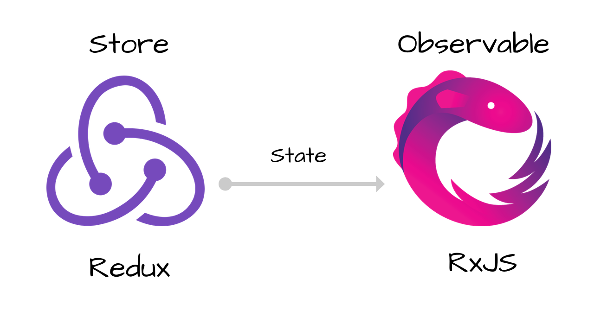

So you've started using [redux-observable](https://redux-observable.js.org/) because it's a powerful. But how can we do the equivalent of `promise.all()` using redux-observable and rxjs ?

> note - this post assumes a basic knowledge of redux, redux-observable and rxjs.

For this example, we will fetch two separate things, and then once both have finished, we will do some kind of processing action.

I think this is quite a common use case but was surprised to not find anything in stackoverflow etc.

## Defining fetching observables

First, let's define a function to fetch one of the pieces of data we need:

```jsx
const fetchTodo = () => (action) =>
  ajax.getJSON("https://jsonplaceholder.typicode.com/todos/" + action.id).pipe(
    map(response =>
      fetchTodoSuccess(response)
    ),
    catchError(error => fetchTodoFailure(error))
  );
```

- Here we are passing in `action` to get the `id` from the payload of the action called to start this epic.
- `fetchToDoSuccess()` and `fetchTodoFailure()` are both actions that will need to be defined.
- `ajax.getJSON` is an rxjs function to make an AJAX request. import it like so: `import { ajax } from 'rxjs/ajax';`
- `catchError` is needed at this level. If not, the error with *bubble up* and cause other requests to stop.

I then defined another function `fetchAnimal` in a similar way.

## Combining Observables

So how do we use these inner observables in our main epic? I had no idea and tried many combinations of things, not really understanding how rxjs really works. (rxjs is very **overwhelming** to begin with.)

After a lot of struggling and help, I finally came to this:

```jsx
const fetchStuffEpic = action$ => (
  action$.pipe(
    ofType("FETCH_STUFF"),
    mergeMap(() =>
        merge(
            fetchTodo(action$),
            fetchLatestApSanity(action$),
        ).pipe(endWith(doProcessFetches())),
    ),
  )
);
```

[mergeMap](https://www.learnrxjs.io/learn-rxjs/operators/transformation/mergemap) is used to `flatten` an inner observable. This essentially means that any inner observable will be 'flattened' into a value. using `mergeMap` means that observables won't be cancelled if another action type named `"FETCH_STUFF"` is received. If you want to cancel fetching when another action of the same type is received, use a `switchMap` instead.

Once inside `mergeMap`, we do a `merge`, calling the two functions that we defined previously. [merge](https://www.learnrxjs.io/learn-rxjs/operators/combination/merge) turns several observables into a **single** observable. In our case, the two functions we defined before were the observables that will be combined.

Merge also ensures that the observables **run in parallel, not one after another**. If you are looking for two actions to run one after another (order is important), use [concat](https://www.learnrxjs.io/learn-rxjs/operators/combination/concat) instead.

Finally, to process the fetches after **both** have finished, we `pipe` an `endWith` function, calling the required action for processing. [endWith](https://www.learnrxjs.io/learn-rxjs/operators/combination/endwith) simply emits a value. (in our case the action we want to dispatch.)

## Conclusion

And that's it!

It's actually quite simple and elegant once you figure out the solution. That's why I think although rxjs has an extremely high learning curve, it's worth it.

#### Links for further reading:

- [Beginners guide to redux-observable](https://blog.logrocket.com/a-beginners-guide-to-redux-observable-c0381da8ed3a/)
- [Official redux-observable gitter for discussion and help.](https://gitter.im/redux-observable/redux-observable) 
  - (Shout out to Evert and Kevin who are extremely helpful and active!)

Let me know what you think in the comments, and as always, sign up to the emailing list if you want to see more posts!
